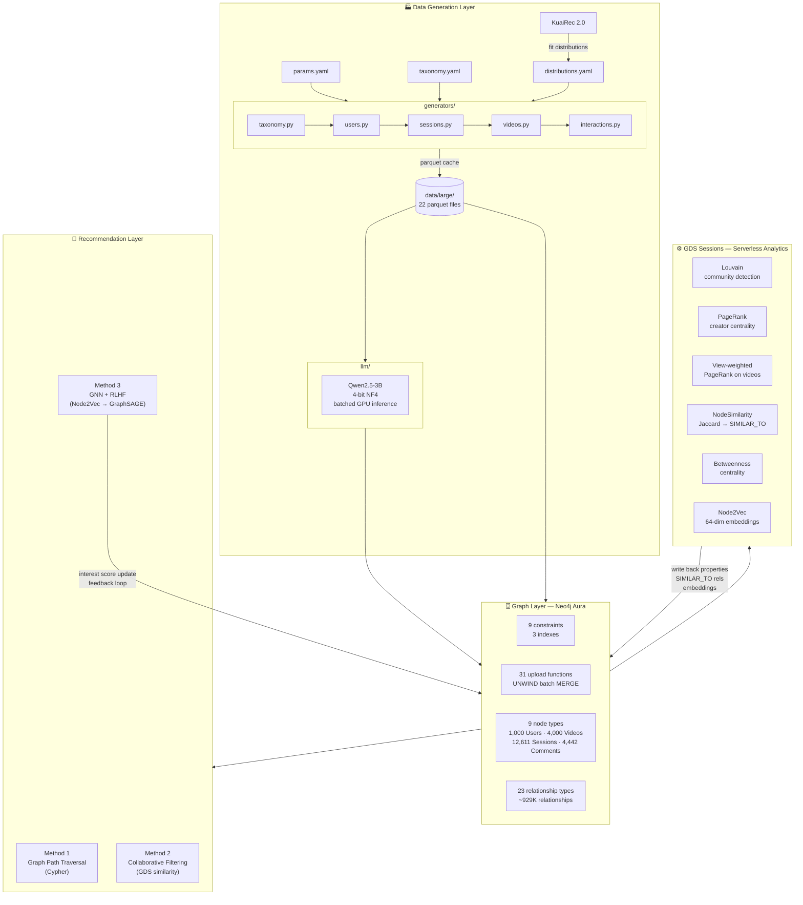
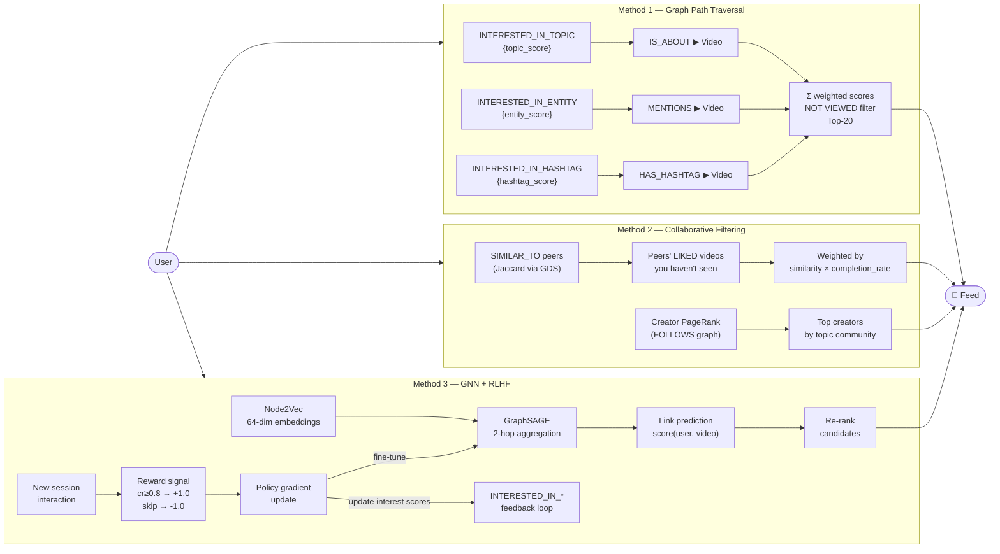

# InterestGraph

> *Modern platforms don't just connect people — they engineer attention. Beneath every scroll lies a property graph of weighted interests, behavioural signals, and similarity scores, tuned in real time to keep you watching. This project builds that machine from scratch.*

**InterestGraph** is a fully synthetic, behaviorally grounded social-media interest graph built on **Neo4j Aura**. It simulates the data infrastructure behind short-video recommendation — 1,000 users, 4,000 videos, 12,611 sessions, and ~929K relationships — and provides three interchangeable recommendation engines at different points on the interpretability ↔ performance spectrum.

All behavioral distributions (watch ratio, skip rate, session length, engagement rates) are fitted directly from **KuaiRec 2.0** — a 100%-density interaction matrix from a real short-video platform.

---

## Architecture



---

## Recommendation Algorithms



---

## Graph Schema

### Node Types

| Label | Key Properties | Description |
|-------|---------------|-------------|
| `User` / `Creator` | `user_id`, `followers`, `country_id`, `community_id`, `pagerank_score` | Users; creators carry a second `:Creator` label |
| `UserSession` | `session_id`, `start_date`, `end_date` | One continuous app-open event |
| `Video` | `video_id`, `video_duration`, `description`, `view_pagerank` | Short-form video content |
| `Comment` | `comment_id`, `comment_text`, `comment_sentiment` | Positive / neutral / negative |
| `Topic` | `topic_id`, `slug` | 12 content verticals |
| `Hashtag` | `hashtag_id`, `name` | 10 per topic = 120 total |
| `Entity` | `entity_id`, `name`, `aliases` | Named entities (brands, people, places) |
| `Sound` | `song_id`, `song_name`, `singer`, `genre` | 30 tracks |
| `Country` | `country_id`, `iso` | 12 markets |

### Relationship Types

| Relationship | Source → Target | Properties |
|---|---|---|
| `HAS_SESSION` | User → UserSession | — |
| `LAST_SESSION` | User → UserSession | — |
| `PREVIOUS_SESSION` | UserSession → UserSession | — |
| `FOLLOWS` | User → User | `engagement_score` |
| `SIMILAR_TO` | User → User | `similarity` *(GDS writeback)* |
| `VIEWED` | UserSession → Video | `watch_time`, `completion_rate` |
| `LIKED` | UserSession → Video | — |
| `SKIPPED` | UserSession → Video | — |
| `REPOSTED` | UserSession → Video | — |
| `COMMENTED` | UserSession → Comment | — |
| `CREATED_BY` | Video → Creator | — |
| `ON_VIDEO` | Comment → Video | — |
| `WRITTEN_BY` | Comment → User | — |
| `IS_ABOUT` | Video → Topic | `is_primary` |
| `HAS_HASHTAG` | Video → Hashtag | — |
| `MENTIONS` | Video → Entity | — |
| `USES_SOUND` | Video → Sound | — |
| `ORIGINATED_IN` | Video → Country | — |
| `RELATED_TO` | Entity → Topic | `is_primary` |
| `FROM_COUNTRY` | User → Country | — |
| `FROM_COUNTRY` | Sound → Country | — |
| `INTERESTED_IN_TOPIC` | User → Topic | `topic_score` ∈ [0, 1] |
| `INTERESTED_IN_ENTITY` | User → Entity | `entity_score` ∈ [0, 1] |
| `INTERESTED_IN_HASHTAG` | User → Hashtag | `hashtag_score` ∈ [0, 1] |

---

## Content Taxonomy

### 12 Topics

| ID | Slug | Country Affinities |
|----|------|--------------------|
| T01 | `cooking_food` | ID, VN, JP, MX |
| T02 | `gaming_esports` | JP, KR, US |
| T03 | `fashion_beauty` | KR, ID, GB |
| T04 | `fitness_wellness` | DE, US, GB |
| T05 | `travel_adventure` | VN, ID, US |
| T06 | `music_dance` | KR, BR, IN, NG |
| T07 | `comedy_entertainment` | BR, PH, MX, NG |
| T08 | `technology_science` | DE, GB, US |
| T09 | `sports_athletics` | BR, US |
| T10 | `education_tutorials` | IN, PH, DE |
| T11 | `art_creativity` | JP, KR |
| T12 | `lifestyle_vlog` | All markets |

### KuaiRec 2.0 Behavioral Distributions

All interaction rates fitted from the full 12.5M-row KuaiRec 2.0 matrix:

| Parameter | Value | Source |
|-----------|-------|--------|
| Median watch ratio | 0.73 | KuaiRec big_matrix |
| Skip threshold | < 0.15 watch ratio | KuaiRec |
| Like rate (P\|viewed) | ~8% | item_daily_features |
| Comment rate (P\|viewed) | ~1.2% | item_daily_features |
| Repost rate (P\|viewed) | ~0.5% | item_daily_features |
| Sessions per user | 5 – 40 (log-normal) | user_features |
| Videos per session | 8 – 80 (Poisson, mean 28) | big_matrix |
| Interest score floor | 0.05 (pruned) | design |

### Interest Score Mechanics

Every interaction applies a delta to the user's `INTERESTED_IN_*` scores for the video's topic, entities, and hashtags:

| Interaction | Delta |
|---|---|
| `SKIPPED` | −0.30 |
| `VIEWED` < 80% completion | +0.10 |
| `VIEWED` ≥ 80% completion | +0.50 × completion_rate |
| `LIKED` | +0.70 |
| `COMMENTED` | +0.60 |
| `REPOSTED` | +0.80 |

Secondary topic receives 0.5× the primary delta. After all sessions: per-user normalise to max = 1.0; prune scores < 0.05.

---

## GDS Analytics (Serverless)

`analysis/gds_runner.py` connects to a **Neo4j Aura GDS Session** and runs all algorithms, writing results back to the main database:

| Algorithm | Input Graph | Writeback |
|---|---|---|
| Louvain community detection | User-Topic (weighted by `topic_score`) | `User.louvain_community`, `User.community_id` |
| PageRank — creator influence | Follow graph (weighted by `engagement_score`) | `User.pagerank_score` |
| View-weighted PageRank | User → Video (weighted by `completion_rate`) | `Video.view_pagerank` |
| NodeSimilarity (Jaccard) | User-Topic | `SIMILAR_TO{similarity}` relationships |
| Betweenness centrality | Follow graph | `User.betweenness_centrality` |
| WCC | Follow graph | `User.wcc_component` |
| Node2Vec (64-dim) | Full interaction graph | `User.node2vec_embedding`, `Video.node2vec_embedding` |
| Creator × Topic centrality | Creators + follower interests + PageRank | `Creator.top_topic`, `Creator.top_topic_score` |

```bash
# Run full GDS pipeline
python analysis/gds_runner.py

# Skip Node2Vec (slow; run separately)
python analysis/gds_runner.py --skip-embeddings
```

---

## Project Structure

```
interest-graph/
│
├── config/
│   ├── params.yaml           # Scale, rates, interest weights — master dials
│   ├── taxonomy.yaml         # Topics, countries, entities, sounds, hashtags
│   └── distributions.yaml    # Fitted histograms from KuaiRec 2.0
│
├── generators/
│   ├── base.py               # Seeded RNG singleton, config loader, helpers
│   ├── taxonomy.py           # Deterministic extractors for all taxonomy nodes
│   ├── users.py              # User nodes, Faker usernames, FOLLOWS graph
│   ├── sessions.py           # UserSession nodes + PREVIOUS_SESSION chaining
│   ├── videos.py             # Video nodes + video→taxonomy relationships
│   ├── interactions.py       # Feed simulation, VIEWED/LIKED/SKIPPED/interest scores
│   └── persistence.py        # Parquet cache (data/large/ — 22 files)
│
├── llm/
│   ├── hf_client.py          # HuggingFace client (Qwen2.5-3B, 4-bit NF4, batched)
│   ├── prompts.py            # 84 description prompts + 36 comment prompts
│   └── generator.py          # fill_video_descriptions, generate_comments, faker fallback
│
├── neo4j/
│   ├── __init__.py           # Package bridge (shadows installed neo4j lib)
│   ├── connection.py         # Driver singleton from .env
│   ├── schema.py             # 9 constraints + 3 indexes (idempotent)
│   └── loader.py             # 32 upload_* functions — UNWIND $batch MERGE
│
├── analysis/
│   ├── kuairec_analysis.py   # Phase 1: fit distributions → distributions.yaml
│   └── gds_runner.py         # GDS Sessions pipeline — all 8 algorithms + writebacks
│
├── queries/
│   ├── recommendations.cypher  # Content-based, collab filtering, trending, creator rec,
│   │                           # real-time interest score update
│   ├── gds_analysis.cypher     # Reference Cypher for all graph projections + algorithms
│   └── exploration.cypher      # Sanity checks, degree distributions, community summaries
│
├── tests/                    # Unit tests (mock-based, no live Neo4j needed)
├── main.py                   # CLI orchestrator — 9-step pipeline
├── requirements.txt
└── .env.example
```

---

## Quickstart

```bash
# 1. Clone and install
git clone https://github.com/marcio-jacob/interest-graph
cd interest-graph
pip install -r requirements.txt

# 2. Configure
cp .env.example .env
# Edit .env — add your Neo4j Aura URI + credentials
# For GDS analytics: add AURA_CLIENT_ID + AURA_CLIENT_SECRET
# (create at console.neo4j.io → API Keys)

# 3. Generate only (no Neo4j, no LLM)
python main.py --scale small --skip-llm --skip-upload

# 4. Generate + upload with faker text
python main.py --scale medium --skip-llm

# 5. Full run with LLM descriptions (requires CUDA GPU)
python main.py --scale large

# 6. Run GDS analytics and write results back to graph
python analysis/gds_runner.py --skip-embeddings
```

### Scale Presets

| `--scale` | Users | Videos | Sessions | Relationships | LLM time |
|-----------|-------|--------|----------|---------------|----------|
| `small` | 100 | 400 | ~1,200 | ~85K | ~8 min |
| `medium` | 500 | 2,000 | ~6,000 | ~450K | ~40 min |
| `large` | 1,000 | 4,000 | ~12,600 | ~929K | ~90 min |

> **LLM**: Uses `Qwen/Qwen2.5-3B` with 4-bit NF4 quantization via HuggingFace Transformers. Requires ~2.5 GB VRAM. Use `--skip-llm` for faker fallback (instant).

---

## Running Tests

```bash
pytest                                  # all tests (mock-based, no Neo4j needed)
pytest tests/test_interactions.py -v   # behavioural simulation
pytest tests/test_neo4j.py -v          # loader + schema (mocked driver)
```

---

## Requirements

- Python 3.10+
- Neo4j Aura (free tier sufficient for `--scale small`; Professional 1 GB for `large`)
- CUDA GPU with ≥ 4 GB VRAM for LLM step (optional — faker fallback available)
- Neo4j Aura API credentials for GDS Sessions (optional — only needed for `gds_runner.py`)

```bash
pip install -r requirements.txt
```

Key packages: `neo4j`, `graphdatascience`, `numpy`, `scipy`, `faker`, `pyyaml`, `tqdm`, `python-dotenv`, `pyarrow`, `transformers`, `bitsandbytes`

---

## License

MIT
